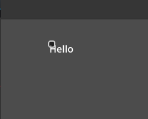

Create a new main.go file

`touch main.go`


```go
package main

import (
	"graphics.gd/classdb"
	"graphics.gd/classdb/Node2D"
	"graphics.gd/classdb/TextEdit"
	"graphics.gd/classdb/Label"
	"graphics.gd/classdb/Button"
	"graphics.gd/startup"
)

type HelloName struct {
	classdb.Extension[HelloName, Node2D.Instance]

	Name TextEdit.Instance
	Text Label.Instance

	Button Button.Instance
}


func (h *HelloName) Ready() {
	h.Button.OnPressed(h.OnButtonPressed)
}

func (h *HelloName) OnButtonPressed() {
	h.Text.SetText("Hello " + h.Name.GetText())
}

func main() {
	classdb.Register[HelloName]()
	startup.Engine()
}
```

Run `go get -u` from the terminal and `go mod tidy`
this should update the module and install it.


After that run `gd` to start the godot project, then save the project in godot.

Change the node to a control node, then add `HelloName` as a child of the control node.

Then run the project inside godot.


If all goes well click the button and you should see hello.



