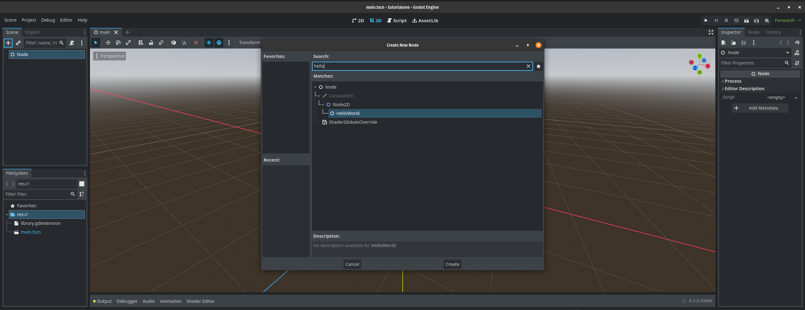
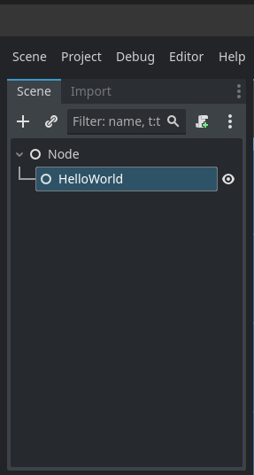

### Hello World Example


installing the module

```sh
go install grow.graphics/gd/cmd/gd@master
```

create a new go project

```sh
go mod init main
```

create a new main.go file

```go
package main

import (
    "fmt"
    "grow.graphics/gd"
    "grow.graphics/gd/gdextension"
)

type HelloWorld struct {
    gd.Class[HelloWorld, gd.Node2D]
}

// Ready implements the Godot Node2D _ready interface (virtual function).
func (h *HelloWorld) Ready(gd.Context) {
    fmt.Println("Hello World from Go!")
}

func main() {
    godot, ok := gdextension.Link()
    if !ok {
        return
    }
    gd.Register[HelloWorld](godot)
}
```

use tidy to make sure the project is up to date and all the dependencies are up to date

```sh
go mod tidy
```

run the project

```sh 
gd
```

with godot editor running add the `HelloWorld` Node to the the node in the current scene and save the project and close it.



add it to the scene tree



Save the project in Godot Editor. 

In godot run the project or by running `gd run` in your terminal.

You may need to close and open the godot editor using `gd` if it cannot map the assets in the project.

If all is well check the editor and you should see the message `Hello World from Go!` in the console of your code editor.