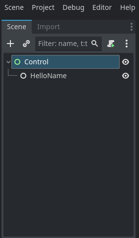
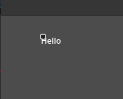

create a new main.go file

`touch main.go`


```go
package main

import (
	"grow.graphics/gd"
	"grow.graphics/gd/gdextension"
)

type HelloName struct {
	gd.Class[HelloName, gd.Node2D]

	Name gd.TextEdit
	Text gd.Label

	Button gd.Button
}


func (h *HelloName) Ready(godot gd.Context) {
	h.Button.AsObject().Connect(godot.StringName("pressed"), godot.Callable(h.OnButtonPressed), 0)
}

func (h *HelloName) OnButtonPressed(godot gd.Context) {
	h.Text.SetText(godot.String("Hello " + h.Name.GetText(godot).String()))
}

func main() {
	godot, ok := gdextension.Link()
	if !ok {
		return
	}
	gd.Register[HelloName](godot)
}
```

run `go get -u` from the terminal and `go mod tidy`


this should update the module and install it.


after that run `gd` to start the godot project, then save the project in godot.

change the node to a control node, then add `HelloName` as a child of the control node.

then run the project inside godot.




if all goes well click the button and you should see hello.


