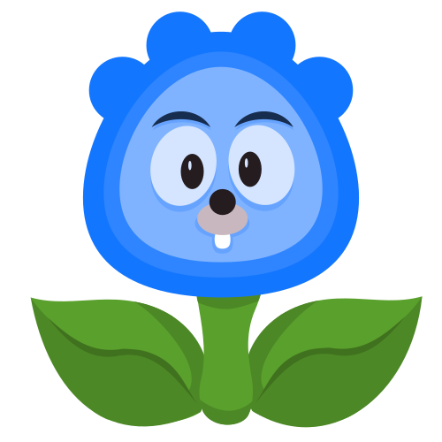

import { Card, CardGrid } from '@astrojs/starlight/components';

## Next steps

<CardGrid stagger>
	<Card title="Grow Graphics Documentation" icon="open-book">
		
		*Go Community Supported GDExtension bindings for Godot*

		- [Our Documentation](https://learn.grow.graphics/documentation)
	</Card>
	<Card title="Github Repository" icon="open-book">
		- [Grow-Graphics GD GitHub Repo](https://github.com/grow-graphics/gd)
	</Card>
	<Card title="Godot Game Engine" icon="add-document">
		
		- [Godot Game Engine](https://godotengine.org)
		- [Godot's Documentation](https://godotengine.org)
		- [GDExtension](https://docs.godotengine.org/en/stable/tutorials/scripting/gdextension/index.html)
	</Card>
	<Card title="Go Programming Language" icon="open-book">
		
		- [Go Programming Language](https://go.dev/)
		- [Effective Go](https://go.dev/doc/effective_go)
		- [Go Standard Library](https://pkg.go.dev/std)
	</Card>
	<Card title="Social" icon="setting">
		Coming Soon!
	</Card>
</CardGrid>
